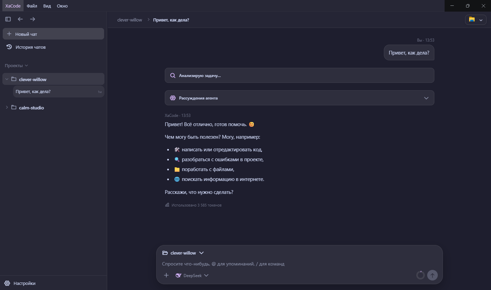
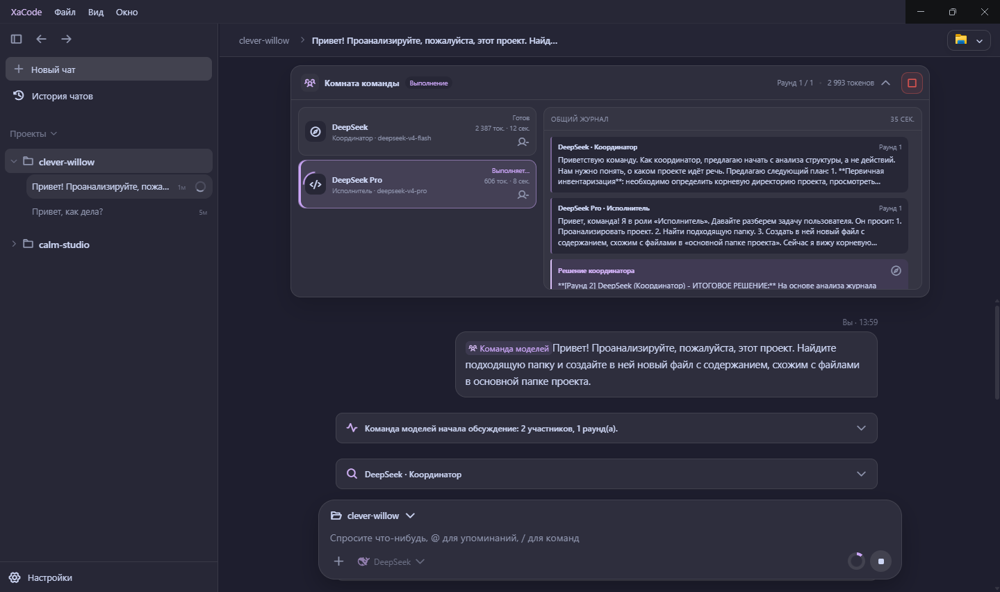
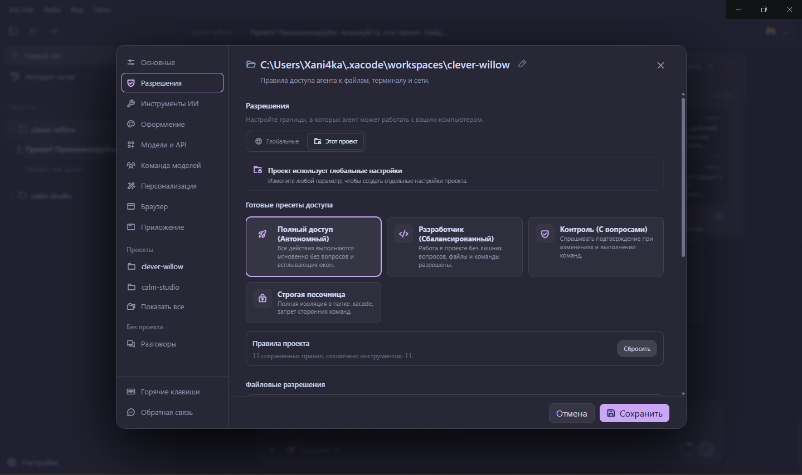

Русский | [English](README.en.md)

# XaCode Desktop


XaCode is an actively developed open-source project. Public adoption metrics will be added as the community grows.

## Описание

XaCode — это локальный AI агент для разработки под Windows. Приложение работает с файлами проекта, терминалом, HTTP, базами SQLite и Docker. Для каждого проекта можно отдельно настроить доступ к инструментам, файлам, командам и сети.

## Основные возможности

1. Глобальные и проектные разрешения с явным наследованием. Полный доступ можно включить сразу для всех проектов или только для выбранного.
2. Строгая проверка аргументов инструментов и структурированные результаты выполнения.
3. VerificationPipeline проверяет результат перед завершением задачи.
4. ProtectionSystem останавливает зацикливание и слишком большое количество вызовов инструментов.
5. Память сохраняет полезный контекст, решения, ошибки и историю сессий.
6. Инструменты агента можно отключать глобально или для проекта. Отключённые схемы не передаются модели и не занимают контекст.
7. Поддержка нескольких моделей.
8. Ключи API защищены средствами Electron safeStorage и Windows DPAPI.

## Интерфейс

### Главный экран



### Команда моделей



### Настройки разрешений



## Установка готовой версии (Рекомендуется)

1. Откройте страницу [GitHub Releases](https://github.com/Xani4kaGitHub/XaCodeApp/releases).
2. Выберите последний стабильный релиз.
3. Скачайте Windows-установщик `.exe`.
4. Запустите установщик.
5. При предупреждении Windows SmartScreen проверьте издателя и источник файла.
6. После установки запустите XaCode.
7. Откройте настройки и добавьте собственный API-ключ.
8. **Внимание:** Никогда не публикуйте API-ключ в Issues или логах.

*Примечание: Установленное приложение автоматически проверяет обновления через GitHub Releases.*

## Установка из исходного кода

Требуется Node.js версии 20 или новее.

```powershell
npm.cmd install
```

## Запуск в режиме разработки

```powershell
npm.cmd run dev
```

## Сборка установщика Windows

```powershell
npm.cmd run dist:win
```

Готовый установщик создаётся в каталоге `release`. Этот каталог, зависимости, секреты, настройки, история и логи не добавляются в Git.

## Запуск тестов

Основные проверки запускаются следующими командами:

```powershell
npm.cmd run build
npm.cmd test
npm.cmd run test:ui
npm.cmd run test:storage
npm.cmd run test:verification
```

## Команда моделей и Multi-agent режим

В настройках «Команда моделей» можно выбрать от двух до четырёх подключений и назначить им роли координатора, архитектора, исполнителя, ревьюера или специалиста. Команда запускается через `/team` либо `@team`.

Модели обсуждают задачу по очереди через общий журнал. Координатор формирует единый план, после чего только один участник с ролью исполнителя получает доступ к инструментам и изменению файлов. Это предотвращает одновременную запись и конфликтующие правки.

Во время командной задачи над чатом открывается живая комната: в ней видны состояния и роли участников, текущий раунд, общий журнал, затраченные токены и время. Отдельного советника можно отключить от обсуждения, а всю команду — остановить одной кнопкой.

## Хранение данных

Все пользовательские данные находятся вне репозитория в каталоге `%USERPROFILE%\.xacode`. Обычно это `C:\Users\имя_пользователя\.xacode`. Переменная `XACODE_HOME` позволяет указать другой каталог.

При первом запуске настройки и история автоматически копируются из старого каталога Electron, если новые файлы ещё не существуют. Ключ API не хранится открытым текстом. Расшифровать его может только тот же пользователь Windows.

## Участие в разработке

Информацию о том, как внести свой вклад в развитие проекта, смотрите в [CONTRIBUTING.md](CONTRIBUTING.md).

## Сообщение об уязвимостях

Если вы обнаружили проблему с безопасностью, пожалуйста, ознакомьтесь с [SECURITY.md](SECURITY.md) перед созданием Issue.

## Лицензия

Проект распространяется под лицензией MIT. Подробности в файле [LICENSE](LICENSE).
